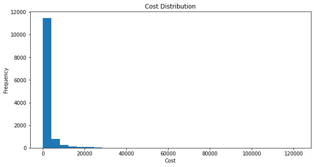
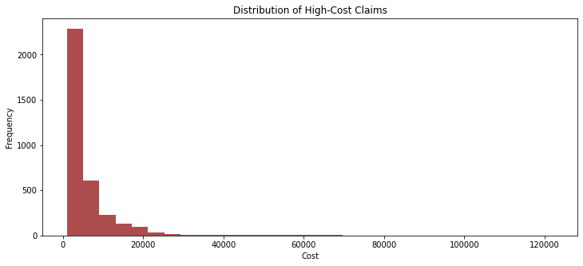
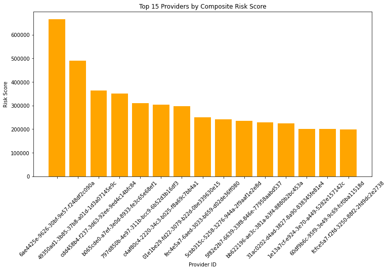

# Azure HealthClaims Analytics 

Azure HealthClaims Analytics engine is a personal data engineering project I built to strengthen my skills in Spark, Scala, distributed computing, and cloud-based data pipelines. The project started as part of my Cloud Computing coursework, where I implemented several Spark algorithms (distributed covariance, matrix multiplication, and a closed-form linear regression engine).

After completing the class, I decided to take the work much further and turn it into a production-style ETL and analytics pipeline that could realistically run in a healthcare analytics environment. To do that, I:

- Re-structured the codebase into independent modules

- Added a healthcare claims ETL workflow

- Implemented provider cost analytics

- Created a Python notebook for downstream analysis

- Deployed the system to Azure Databricks (leveraging the 14 day trail period) using ADLS and Unity Catalog

The result is a single-developer project that demonstrates both deep technical understanding (Scala/Spark) and practical data engineering workflows (ETL, KPIs, cloud deployment).


# Project Overview

This project simulates a simplified healthcare data pipeline:

1. Raw claims data (CSV/Excel) is ingested from Azure Storage.

2. A Spark-based ETL job cleans, standardizes, and curates the data.

3. A Cost KPI module computes provider-level metrics used in real cost-of-care analytics.


Additional distributed computing modules (covariance, matrix multiply, linear regression) are included from my Cloud Computing assignment as examples of parallel numerical analytics on Spark.


# Dataset: Synthetic Healthcare Claims Dataset (Synthea)

This project uses a synthetic healthcare claims dataset generated by MITRE Synthea, an open-source tool for producing realistic (but non-identifiable) patient health records.

Source: MITRE Synthea

Dataset: 100 Sample Synthetic Patient Records

Format: CSV

Size: ~7 MB

Purpose: Used for developing and evaluating healthcare analytics pipelines without exposing real patient data.

🔗 Download link:
https://synthea.mitre.org/downloads

# Module Descriptions

## Claims ETL Pipeline (Scala)
This module ingests raw healthcare claims files, enforces schema consistency, handles missing values, deduplicates claim IDs, standardizes timestamps, and writes a curated Parquet dataset.

## Cost KPI Analytics (Scala)

This job reads curated claims and computes:

    - Number of claims per provider

    - Total cost

    - Average cost

    - Maximum claim cost

    - High-cost claim flagging


## Distributed Numerical Computing (From Course Assignment)

The following modules originated from my Cloud Computing coursework:

- Covariance Engine

- Matrix Multiply

- Closed-Form Linear Regression (Spark SQL + Breeze)

I decided to keep these modules in the project because they complement the ETL and KPI layers by demonstrating:

- Parallel processing

- RDD transformations

- Linear algebra on Spark

- Understanding of distributed computation


# Architecture
```
Raw Data (Azure Storage)
        │
        ▼
Claims ETL (Scala + Spark)
        │
        ▼
Curated Claims (Parquet / ADLS)
        │
   ┌───────────────┬────────────────┐
   ▼               ▼                ▼
Cost KPI Engine   Python EDA     ML / Numerical
(Scala)           (Pandas)       (Covariance, LR, Multiply)
```

# Repository Structure
```bash
AzureSpark-Analytics-Layer/
│
├── data/                         # Sample datasets
├── python/
│   └── summary.ipynb             # Python exploratory analysis
│
├── src/main/scala/
│   ├── etl/
│   │   └── ClaimsETL.scala       # Curates healthcare claims data
│   ├── analytics/
│   │   └── CostKPI.scala         # Provider-level KPIs
│   ├── matrix/                   # From CC assignment
│   │   ├── Multiply.scala
│   │   ├── Covariance.scala
│   ├── regression/
│   │   └── LR.scala              # Closed-form regression (Spark SQL)
│   └── utils/
│        └── SparkBuilder.scala
│
└── build.sbt
```
## Azure Databricks Deployment

Although my original coursework did not require cloud deployment, I extended the project to run fully on Azure Databricks, including:

- Uploading JARs to Unity Catalog Volumes

- Mounting ADLS / Blob storage for input and output

- Running workflows as Databricks Jobs

- Using Parquet as the curated analytics layer

This was a valuable learning experience and helped me understand how production data pipelines run in real cloud environments.

## Typical Job Configuration
```
Main class: etl.ClaimsETL
Parameters:
   /mnt/raw/claims.csv
   /mnt/curated/claims/
```


## Results

### Cost Distribution Analysis

The histogram shows the distribution of healthcare claim costs after Spark-based ETL.
Most claims fall within lower cost ranges, while a small number of high-cost claims form
a long right tail, reflecting realistic healthcare spending patterns.




### High-Cost Claims Distribution

The histogram below shows the distribution of high-cost healthcare claims, identified using a cost-based threshold derived from the upper tail of the claims cost distribution. While most claims fall within lower cost ranges, a small subset of claims incur significantly higher costs, producing a right-skewed distribution.

This pattern reflects realistic healthcare spending behavior, where a limited number of high-cost events account for a disproportionate share of total expenditures.



### Composite Risk by Provider

The bar chart below presents a composite risk score aggregated at the provider level. This score combines multiple cost-based indicators—such as total cost contribution and high-cost claim frequency—into a single metric representing overall provider risk.

The results show that a small number of providers exhibit elevated composite risk scores, highlighting how provider-level KPIs can be used to support risk stratification, cost monitoring, and targeted cost-control strategies in healthcare analytics.


